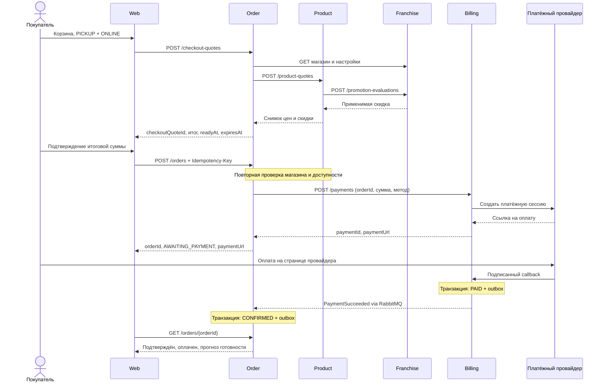

# Контракты взаимодействия

Это проект контрактов уровня архитектурного ДЗ, а не полная OpenAPI/AsyncAPI-спецификация. Ниже заданы владельцы, потребители, операции, существенные поля, результаты, ошибки и гарантии. Область ответственности — в [карточках](services.md), сценарии — в [user-scenario.md](user-scenario.md).

## 1. Общие соглашения

- Синхронный протокол: HTTPS, JSON UTF-8. `/api/v1` доступен через Web Application, `/internal/v1` — только доверенным сервисам. Браузер не вызывает внутренние операции. Публичный путь может использоваться и сервисным клиентом с соответствующим scope.
- Идентификаторы — непрозрачные строки (в реализации UUID); примеры сокращены для читаемости. `storeId` присутствует во всех объектах магазина. `customerId` берётся из токена, а не из произвольного поля браузера.
- `Money = {amountMinor: integer >= 0, currency: string}`; `currency` — код валюты. Арифметика целочисленная, округление процентной скидки вниз до минимальной единицы. Смешивать валюты запрещено. Цены и тарифы считаются конечными для текущего рынка; выделение налоговых компонентов потребует расширения контракта.
- `Address = {countryCode, city, street, house, apartment?, latitude, longitude}`; `Contact = {name, phone}`. Время — ISO 8601 UTC, `timeZone` магазина — IANA, например `Europe/Moscow`. Часы работы и ежедневные акции интерпретируются локально в этом поясе. Текстовые поля меню/магазина локализуются по `Accept-Language` с возвратом использованной `locale`.
- Все изменяющие бизнес-команды требуют `Idempotency-Key`; область уникальности — субъект + операция + ключ. Повтор того же тела возвращает тот же ресурс и результат; другое тело с тем же ключом — `409 IDEMPOTENCY_CONFLICT`. Ключи сохраняются минимум 24 часа, а уникальность платежа/доставки на заказ и возврата на отмену — весь срок хранения заказа.
- Изменение корзины и бизнес-состояний требует `expectedVersion`; версия увеличивается в локальной транзакции. Конфликт версии — `409 VERSION_CONFLICT`. Списки поддерживают `limit/cursor` и возвращают `{items, nextCursor}`.
- Успешные чтения — `200`; создание — `201`; принятая, но ещё не завершённая операция — `202`. Возвращается `requestId`. Общие ошибки: `400 INVALID_REQUEST`, `401 UNAUTHENTICATED`, `403 FORBIDDEN`, `404 NOT_FOUND`, `409` для конфликта состояния, `422` для невыполнимого бизнес-условия, `503 DEPENDENCY_UNAVAILABLE` для временного отказа зависимости.
- Ошибка: `{code, message, details, requestId}`. Например `{"code":"ITEM_UNAVAILABLE","message":"Позиция недоступна","details":{"productIds":["blt"]},"requestId":"req-1"}`. Клиент принимает решения по `code`.

### Доступ

Web использует OIDC Authorization Code с PKCE и защищённую HttpOnly-сессию. Identity выдаёт короткоживущий access token (5 минут): `sub`, `roles`, `storeIds`, `iss`, `aud`, `exp`. Сервис проверяет подпись по кешированному JWKS и затем права на конкретный объект. Покупатель читает только свои заказы/платежи, персонал — объекты разрешённого магазина, курьер — назначенную ему доставку. Меню, список магазинов и акции доступны публично.

Внутренние вызовы используют сервисную аутентификацию (mTLS и access token с необходимым scope); пользовательский контекст передаётся там, где нужно проверить исполнителя. Роль `NETWORK_ADMIN` назначает доступ, но сама по себе не даёт права подтверждать платёж. UI не является единственной точкой авторизации. Подписки RabbitMQ ограничиваются очередями потребителя, публикация — событиями сервиса-издателя.

## 2. Синхронные контракты

### I. Identity

| Операция | Потребитель и вход | Результат / правила |
| --- | --- | --- |
| `POST /api/v1/registrations` | Web: `{email, password, displayName}` | `{userId}`, роль CUSTOMER; `409 ACCOUNT_EXISTS` |
| OIDC `/authorize`, `/token`, `/logout` | Web: вход, обмен code, обновление/завершение сессии | Стандартные OIDC/OAuth ответы; адреса публикуются в `/.well-known/openid-configuration` |
| `GET /.well-known/jwks.json` | Web и все сервисы | Публичные ключи, обновление кеша при новом `kid`; недоверенный токен не принимается |
| `GET /api/v1/me` | Web: токен пользователя | `{userId, displayName, roles, storeIds}` |
| `PUT /api/v1/users/{userId}/access` | Web, NETWORK_ADMIN: `{roles, storeIds, expectedVersion}` | Новая версия назначения прав; запрет самоповышения при регистрации |

### F. Franchise

| Операция | Потребитель и вход | Результат / правила |
| --- | --- | --- |
| `GET /api/v1/stores[/{storeId}]` | Web; Product, Order, Delivery, Map используют вариант по ID | `{storeId, ownerId, countryCode, address, timeZone, currency, hours, acceptingOrders, paymentMethods, preparation:{baseMinutes,perItemMinutes,parallelOrders}, delivery:{enabled,zone,fee}, version}`. В публичном представлении скрыты внутренние настройки |
| `POST /api/v1/stores`, `PATCH /api/v1/stores/{storeId}` | Web: администратор создаёт, управляющий меняет разрешённые поля своего магазина | `{storeId, version}`. Валюта существующего магазина с заказами не меняется произвольно; новая валюта требует миграционного решения |
| `GET /api/v1/promotions?storeId=...` | Web | Национальные и локальные акции: `{promotionId, scope, countryCode, storeId?, name, startsAt, endsAt, rule, version}` |
| `POST /api/v1/promotions`, `PATCH /api/v1/promotions/{promotionId}` | Web: `{scope:NATIONAL/LOCAL, countryCode, storeId?, name, startsAt, endsAt, rule, expectedVersion?}` | Создание/изменение/отключение акции; национальная — только NETWORK_ADMIN; локальная — MANAGER своего магазина |
| `POST /internal/v1/promotion-evaluations` | Product: `{storeId, currency, lines:[{productId, quantity, lineSubtotalMinor}]}` | `{promotionId?, promotionVersion?, discountMinor, evaluatedAt}`. Используется серверное время; доверенные суммы поступают только от Product |

Правило первой версии: процентная скидка `rule={productIds:[], percent:integer 1..100}` на указанные товары (пустой список — все товары). Выбирается одна акция с максимальной суммарной скидкой; при равенстве сравнивается `promotionId`. Сроки действия задаются с учётом пояса магазина. Franchise владеет **правилом и результатом скидки**, Product — **базовыми ценами и итогом товаров**.

### P. Product

| Операция | Потребитель и вход | Результат / правила |
| --- | --- | --- |
| `GET /api/v1/stores/{storeId}/menu`, `GET /api/v1/products/{productId}` | Web | Продукты: `{productId, name, description, categoryId, locale}`; в меню также `{unitPrice:Money, available, version}` |
| `POST /api/v1/products`, `PATCH /api/v1/products/{productId}` | Web, NETWORK_ADMIN: описание, категория, переводы | Продукт и версия |
| `PUT /api/v1/stores/{storeId}/menu/{productId}` | Web, MANAGER: `{unitPrice, available, listed, expectedVersion}` | Позиция меню магазина; `listed=false` убирает из ассортимента, не удаляя историю заказов |
| `POST /internal/v1/product-quotes` | Order: `{storeId, items:[{productId,quantity}]}` | `{productQuoteId, storeId, lines:[{productId,name,quantity,unitPriceMinor,lineSubtotalMinor,menuVersion}], currency, subtotalMinor, discountMinor, promotionId?, promotionVersion?, itemsTotalMinor, expiresAt}` |
| `POST /internal/v1/availability-checks` | Order: `{storeId, productIds:[]}` | `{available:true, checkedAt}` либо `422 ITEM_UNAVAILABLE` со списком позиций |

При расчёте Product читает свои актуальные цены, сведения о валюте магазина во Franchise и запрашивает оценку акции. `expiresAt = now + 5 minutes`; скидка, действовавшая на момент расчёта, фиксируется на этот срок даже при завершении акции. Если Franchise недоступен, окончательный расчёт возвращает `503`, не подменяя неизвестную скидку нулём. Проверка доступности не является резервом ингредиентов.

### DQ. Расчёт доставки

| Операция | Потребитель и вход | Результат / правила |
| --- | --- | --- |
| `POST /internal/v1/delivery-quotes` | Order: `{storeId, address}` | `{deliveryQuoteId, storeId, address, fee:Money, expiresAt, settingsVersion}`; действие 5 минут |
| `POST /internal/v1/delivery-checks` | Order: `{deliveryQuoteId}` | `{available:true, checkedAt}` либо `422 DELIVERY_UNAVAILABLE` / `ADDRESS_OUTSIDE_ZONE`, `409 QUOTE_EXPIRED` |

Delivery получает во Franchise зону и тариф. В первой версии тариф фиксирован для зоны магазина; проверка попадания координат в зону не требует Map. Цена действующего предложения сохраняется, но перед созданием заказа повторно проверяются включённость доставки и зона. Назначение курьера при расчёте не гарантируется: оно выполняется после подтверждения заказа.

### O. Order и оформление

| Операция | Потребитель и вход | Результат / правила |
| --- | --- | --- |
| `POST /api/v1/carts` | Web: `{storeId, source:WEB/FAX, contact?}` | `{cartId, version}`. FAX разрешён сотруднику магазина, для него `customerId=null` |
| `GET /api/v1/carts/{cartId}` | Web, владелец корзины | `{cartId, storeId, source, items, version}` |
| `PUT /api/v1/carts/{cartId}/items/{productId}`, `DELETE` того же пути | Web: `{quantity, expectedVersion}`; удаление использует `expectedVersion` | Новая версия корзины. Изменение магазина требует новой корзины |
| `POST /api/v1/checkout-quotes` | Web: `{cartId, cartVersion, fulfillmentType, paymentMethod, contact, address?}` | `{checkoutQuoteId, lines, promotionId?, subtotalMinor, discountMinor, deliveryFeeMinor, total:Money, readyAt, expiresAt}` |
| `POST /api/v1/orders` | Web: `{checkoutQuoteId, cartVersion}` | `{orderId, status, paymentId?, paymentUrl?, readyAt, paymentExpiresAt?, version}`; `201` либо `202` при продолжающемся создании платежа |
| `GET /api/v1/orders[/{orderId}]` | Web: покупатель — свои, сотрудник/управляющий — свой магазин | Заказ со снимками позиций, суммы, `orderStatus`, `paymentStatus`, `deliveryStatus?`, `readyAt`, `attentionReason?`, `version`; для ожидающего оплаты заказа владельцу также `paymentUrl?` |
| `POST /api/v1/orders/{orderId}/payment-attempts` | Web, владелец: `{expectedVersion}` | Order вызывает Billing `/attempts`; возвращает ссылку/состояние. Только AWAITING_PAYMENT до истечения срока |
| `POST /api/v1/orders/{orderId}/actions` | Web: `{action:START_PREPARATION/MARK_READY/COMPLETE_PICKUP/CANCEL, expectedVersion, reason?}` | Обновлённый заказ; `409 INVALID_STATE`, `PAYMENT_NOT_CONFIRMED` либо `VERSION_CONFLICT` |

Order сохраняет checkout quote на сервере: владельца/автора, версию корзины, результаты Product и Delivery, выбранные способы, контакты и настройки магазина. `expiresAt` равен минимуму сроков исходных расчётов, не более 5 минут. Итог: `subtotalMinor - discountMinor + deliveryFeeMinor`; валюта всех частей одинакова. Клиент не передаёт свою итоговую сумму при создании заказа.

При `POST /orders` Order проверяет владельца, срок, версию корзины, разрешённую пару способов, текущую возможность магазина принимать заказы, доступность блюд и доставку. Затем в **своей транзакции** помечает quote использованным, фиксирует заказ `CREATING_PAYMENT` и очищает корзину. Один quote/одна версия корзины создаёт не более одного заказа, даже с разными ключами запроса. Другие предложения этой версии корзины становятся недействительными. Снимок принятой суммы после этого не пересчитывается.

Order вызывает Billing с ключом, производным от `orderId`. При успехе сохраняет `paymentId`: ONLINE → `AWAITING_PAYMENT`, остальные → `CONFIRMED` с `OrderConfirmed` в outbox. Неопределённый результат оставляет `CREATING_PAYMENT`; фоновый обработчик повторяет тот же запрос/читает платёж по `orderId`. Корзина уже преобразована в видимый заказ: второй заказ не создаётся. Дедлайн подготовки/ожидания онлайн-оплаты — 15 минут от создания заказа; при его истечении следует `CANCELLED` и событие отмены. Все внешние вызовы выполняются вне локальной DB-транзакции.

### B. Billing

| Операция | Потребитель и вход | Результат / правила |
| --- | --- | --- |
| `POST /internal/v1/payments` | Только Order: `{orderId, storeId, customerId?, createdBy, source, amount:Money, paymentMethod, expiresAt?, returnUrl?}` | `{paymentId, orderId, status, paymentUrl?, version}`; один платёж на заказ; `201` или `202` при неизвестном результате провайдера |
| `GET /internal/v1/payments/by-order/{orderId}` | Order, восстановление после таймаута | Платёж и текущая платёжная ссылка; `404` означает, что безопасно повторить создание с прежним ключом |
| `POST /internal/v1/payments/{paymentId}/attempts` | Только Order: `{orderId}` | Новая попытка и ссылка после подтверждённого отказа предыдущей; при неизвестном исходе возвращается существующая попытка/`202` |
| `GET /api/v1/payments/{paymentId}` | Web: владелец либо персонал магазина | `{paymentId, orderId, amount, method, status, refundStatus?, version}` |
| `POST /api/v1/payments/{paymentId}/cash-receipts` | Web от EMPLOYEE для AT_PICKUP; Delivery от назначенного курьера для ON_DELIVERY: `{receivedAmount:Money, receiptReference}` | `{paymentId, status:PAID, version}` и `PaymentSucceeded`; сумма должна точно совпасть, для ONLINE — `409 INVALID_PAYMENT_METHOD` |
| `POST /api/v1/payments/{paymentId}/cash-refunds` | Web от EMPLOYEE магазина: `{returnedAmount:Money, receiptReference}` | Подтверждение ручного полного возврата только при открытом возврате наличного платежа; `RefundStatusChanged` |
| `POST /callbacks/v1/payments/{provider}` | Платёжный провайдер: подписанные provider event ID, reference, статус, сумма/валюта | После проверки подписи и сохранения — `200`; дубликат тоже `200`. При невозможности сохранить — ошибка для повтора провайдером |

Конкретный формат API/подписи внешнего провайдера определяется выбранным адаптером; Billing нормализует его. Запросы создания, отмены, возврата и сверки идут от Billing к провайдеру по HTTPS. Возврат пользователя на `returnUrl` не меняет состояние платежа. `returnUrl` разрешён только для доверенного домена магазина.

Один заказ может иметь несколько последовательных попыток, но не две активные попытки с неизвестным результатом. Billing проверяет совпадение суммы/валюты callback и его принадлежность попытке, сохраняет факт получения денег единожды. Возврат онлайн-платежа идемпотентен по `paymentId + cancellation`; при наличной оплате отмена открывает ручной возврат, завершить который может сотрудник. Неподтверждённый возврат показывается как `PENDING/FAILED`, а не как завершённый.

При ответе Billing `202` платёжный ресурс уже существует, но ссылка может быть ещё неизвестна. Order сверяет его в фоне через чтение по `orderId` и обновляет доступную покупателю ссылку, сохраняя сумму и идентификатор. Billing самостоятельно закрывает возможность новых попыток по `expiresAt`. Позднее списание после этого срока возвращается даже при задержке `OrderCancelled`; Order также проверяет дедлайн перед подтверждением заказа.

Для ON_DELIVERY Billing принимает cash receipt только от сервисного клиента Delivery с контекстом курьера: Delivery уже проверил текущее назначение. Для AT_PICKUP Billing сам проверяет роль сотрудника и магазин. Покупатель не имеет доступа к этим командам.

### D. Выполнение доставки

| Операция | Потребитель и вход | Результат / правила |
| --- | --- | --- |
| `PUT /api/v1/couriers/me/availability` | Web от COURIER: `{storeId, available, expectedVersion}` | Доступность курьера своего магазина; занятость определяется назначениями, её нельзя сбросить этим запросом |
| `GET /api/v1/deliveries[/{deliveryId}]` | Web: покупатель своей доставки, персонал магазина, назначенный курьер | `{deliveryId, orderId, storeId, courierId?, status, pickupAddress, address, contact, amountToCollect, paymentStatus, version}`; контакт получателя — только имеющим право выполнить заказ |
| `POST /api/v1/deliveries/{deliveryId}/actions` | Web: `{action:PICK_UP/DELIVER/FAIL/RETRY_ASSIGNMENT, expectedVersion, reason?}` | Новый статус; первые три действия — только назначенный курьер, повтор назначения — сотрудник/управляющий магазина |
| `POST /api/v1/deliveries/{deliveryId}/cash-payment` | Web от назначенного курьера: `{receivedAmount, receiptReference, expectedVersion}` | Delivery проверяет ON_DELIVERY и `IN_TRANSIT`, вызывает Billing с тем же ключом, сохраняет подтверждение оплаты; повтор завершает тот же шаг |
| `GET /api/v1/deliveries/{deliveryId}/route` | Web от назначенного курьера | Delivery вызывает Map с координатами; возвращает маршрут либо `503 ROUTE_UNAVAILABLE` |

При `OrderConfirmed` типа DELIVERY создаётся ровно одна доставка. В одной транзакции Delivery назначает доступного курьера и помечает его занятым; если свободного нет, состояние `ASSIGNMENT_FAILED` и событие `DeliveryAssignmentFailed`. Повтор назначения возможен только для активного заказа и доставки без забора. `OrderReady` разрешает PICK_UP; `OrderCancelled` закрывает доставку и освобождает курьера. Онлайн-оплата уже отражена в снимке подтверждённого заказа; последующие платежи принимаются по событиям Billing. После успешного cash receipt Delivery может обновить свою проекцию сразу по ответу Billing.

DELIVER разрешён только для `IN_TRANSIT` и `PAID`. При задержке платёжного события операция возвращает `409 PAYMENT_NOT_CONFIRMED`; UI обновляет статус и позволяет повторить. FAIL после забора означает исключительную ситуацию и передаётся сотруднику; автоматического возврата без выяснения факта вручения нет.

### M. Map

| Операция | Потребитель и вход | Результат / правила |
| --- | --- | --- |
| `GET /api/v1/routes?origin=lat,lon&storeId=...&departureAt=...` | Web, маршрут для самовывоза | Map получает координаты магазина во Franchise |
| `GET /api/v1/routes?origin=lat,lon&destination=lat,lon&departureAt=...` | Delivery, маршрут курьера | Передаются только координаты, без имени/телефона получателя |

Оба варианта возвращают `{distanceMeters, durationSeconds, polyline, provider, trafficIncluded, calculatedAt}`. Начало и назначение обязательны; `storeId` и `destination` взаимоисключающие. Провайдер A выбирается по стране, при отказе/таймауте используется B с подходящим покрытием. Оба получают HTTPS-запрос маршрута с пробками; их различные ответы нормализуются адаптерами. При отказе обоих — `503 ROUTE_UNAVAILABLE`; вызывающая сторона продолжает показывать адрес. Время в пути не заменяет `readyAt` кухни.

## 3. Асинхронные контракты

Обмен: RabbitMQ, AMQP/TLS, JSON. Routing key: `<producer>.<event-type>.v1`, например `billing.payment-succeeded.v1`. У каждого сервиса-потребителя своя durable-очередь; у каждого потока издателя сохраняется порядок сообщений одного агрегата. Publisher confirms и consumer ACK после локальной транзакции дают **at-least-once**, не exactly-once.

Общая оболочка:

```json
{
  "eventId": "evt-123",
  "eventType": "PaymentSucceeded",
  "schemaVersion": 1,
  "producer": "billing",
  "aggregateId": "pay-123",
  "aggregateVersion": 2,
  "occurredAt": "2026-09-27T12:00:00Z",
  "correlationId": "ord-123",
  "data": {
    "paymentId": "pay-123",
    "orderId": "ord-123",
    "storeId": "store-1",
    "amount": {"amountMinor": 81000, "currency": "RUB"},
    "paymentMethod": "ONLINE",
    "paidAt": "2026-09-27T12:00:00Z"
  }
}
```

`eventId` неизменен при повторе. `aggregateVersion` относится к версии агрегата издателя, а не к общему порядку событий всей системы; пропуски версий возможны, поскольку не каждое изменение публикуется. Обязательные общие поля payload — `orderId`, `storeId`; дополнительные поля перечислены ниже.

| Издатель → потребитель | Событие | Обязательные поля `data` сверх общих | Действие потребителя |
| --- | --- | --- | --- |
| Order → Delivery | `OrderConfirmed` | `customerId` (nullable), `fulfillmentType`, `paymentId`, `paymentMethod`, `paymentStatus`, `total:Money`, `pickupAddress`, `address` (nullable для PICKUP), `contact`, `readyAt`, `deliveryQuoteId` (nullable) | Для DELIVERY создать доставку и назначить курьера; для PICKUP ничего не создавать |
| Order → Delivery | `OrderReady` | `fulfillmentType`, `readyAt` | Для DELIVERY разрешить забор; это фактическая готовность, а не прогноз; PICKUP игнорируется |
| Order → Billing, Delivery | `OrderCancelled` | `fulfillmentType`, `reason`, `cancelledAt`; `paymentId` может быть null | Billing отменяет обязательство/возвращает полученные деньги; Delivery отменяет доставку/назначение для DELIVERY |
| Billing → Order, Delivery | `PaymentSucceeded` | `paymentId`, `amount:Money`, `paymentMethod`, `paidAt` | Обновить проекцию оплаты; Order подтверждает ONLINE, если ещё не отменён; Delivery разрешает вручение |
| Billing → Order | `PaymentFailed` | `paymentId`, `attemptId`, `reasonCode` | Показать подтверждённый отказ попытки, оставить возможность повторить до дедлайна |
| Billing → Order | `RefundStatusChanged` | `paymentId`, `refundId`, `amount:Money`, `status:PENDING/SUCCEEDED/FAILED`, `reasonCode?` | Отобразить состояние возврата, не менять CANCELLED обратно на активный заказ |
| Delivery → Order | `DeliveryAssigned` | `deliveryId`, `courierId` | Показать назначение и убрать проблему предыдущего назначения |
| Delivery → Order | `DeliveryAssignmentFailed` | `deliveryId`, `reasonCode` | До PREPARING отменить; позже установить `attentionReason` для сотрудника |
| Delivery → Order | `DeliveryPickedUp` | `deliveryId`, `courierId`, `pickedUpAt` | READY → OUT_FOR_DELIVERY |
| Delivery → Order | `DeliveryDelivered` | `deliveryId`, `deliveredAt` | Зафиксировать вручение; перейти в COMPLETED после наличия PAID в проекции Order |
| Delivery → Order | `DeliveryFailed` | `deliveryId`, `reasonCode`, `failedAt` | Зафиксировать проблему вручения и показать сотруднику |
| Delivery → Order | `DeliveryCancelled` | `deliveryId`, `cancelledAt` | Обновить проекцию доставки отменённого заказа |

### Надёжность и развитие схем

1. Изменение состояния и outbox-событие сохраняются в одной транзакции БД издателя. Relay отправляет сообщение с publisher confirm; при неизвестном результате повторяет тот же `eventId`.
2. Потребитель в одной транзакции записывает `eventId` в inbox, изменяет своё состояние и при необходимости создаёт собственный outbox. Повтор уже обработанного события только подтверждается.
3. Порядок сохраняется по агрегату при отправке и обработке (последовательная обработка/партиционирование по ключу). Между потоками Order, Billing и Delivery общего порядка нет. Событие о платеже может прийти до сохранения `paymentId` в Order, а оплата — до создания Delivery: факт сохраняется по `orderId` и применяется после появления связанного объекта. `OrderConfirmed` дополнительно содержит актуальный снимок оплаты.
4. Поздний `PaymentFailed` не откатывает PAID. CANCELLED не возобновляется поздним `OrderConfirmed/PaymentSucceeded`. `OrderCancelled` сохраняется как признак отмены даже при отсутствии платежа или доставки: последующее создание по тому же `orderId` запрещено. Поздний успех оплаты отменённого заказа приводит к возврату в Billing.
5. При задержке `PaymentSucceeded` относительно `DeliveryDelivered` Order сохраняет факт вручения, но завершает заказ только после обработки обоих фактов. Нельзя просто игнорировать событие, для которого ещё не выполнена предпосылка.
6. Временные ошибки повторяются с экспоненциальной задержкой. Необрабатываемые сообщения попадают в DLQ с оповещением оператора; после исправления возвращаются в исходную очередь с тем же `eventId`. Отставание outbox и незавершённые оформления также наблюдаются.
7. Совместимые изменения добавляют необязательные поля. Удаление/смена смысла обязательного поля требует `schemaVersion=2` и нового routing key с периодом совместного обслуживания. Неизвестные дополнительные поля v1 игнорируются; неизвестная обязательная версия отправляется в DLQ.
8. Контакты и адреса передаются только в необходимую очередь Delivery; поля не включаются в общие технические логи. Срок хранения персональных данных определяется отдельно от проектирования декомпозиции.

## 4. Состояния и компенсации

| Агрегат | Основные переходы |
| --- | --- |
| Order, онлайн | CREATING_PAYMENT → AWAITING_PAYMENT → CONFIRMED → PREPARING → READY → COMPLETED (самовывоз) |
| Order, оплата при получении | CREATING_PAYMENT → CONFIRMED → PREPARING → READY → COMPLETED (самовывоз); выдача только после PAID |
| Order, доставка | После READY: OUT_FOR_DELIVERY → COMPLETED; требуется подтверждённая доставка и PAID |
| Order, отмена | CREATING_PAYMENT / AWAITING_PAYMENT / CONFIRMED → CANCELLED; после PREPARING команда отмены отклоняется |
| Payment | ONLINE: PENDING → PAID; отказ относится к попытке, позволяет повтор до срока. При получении: AWAITING_COLLECTION → PAID. Неоплаченное обязательство при отмене → CANCELLED |
| Refund | После отмены оплаченного заказа: PENDING → SUCCEEDED/FAILED; FAILED допускает безопасный повтор. Состояние платежа после полного возврата — REFUNDED |
| Delivery | PENDING_ASSIGNMENT → ASSIGNED → IN_TRANSIT → DELIVERED; отсутствие курьера → ASSIGNMENT_FAILED; повтор → ASSIGNED; до забора возможен CANCELLED; после забора ошибка → FAILED |

| Сбой / гонка | Поведение |
| --- | --- |
| Product/Franchise/Delivery недоступен при расчёте | `503`, заказ не создан, корзина сохранена; нельзя молча считать скидку/доставку нулевой |
| Истёк quote, корзина изменена, магазин закрыт | `409 QUOTE_EXPIRED/CART_CHANGED` или `422 STORE_NOT_ACCEPTING_ORDERS`; требуется новое подтверждение |
| Billing не ответил при оформлении | Заказ CREATING_PAYMENT, `202`; повтор с прежним ключом и сверка по orderId, без повторного списания |
| Order получил быстрый callback-событие до сохранения ссылки на платёж | Inbox сохраняет факт по orderId; восстановление связывает один платёж и заказ; состояние не откатывается на AWAITING_PAYMENT |
| Отмена и начало приготовления одновременно | Проверка состояния/версии в одной транзакции Order; проигравшая команда получает `409` |
| Отмена пришла в Billing до запроса создания платежа | Сохраняется запрет по orderId; поздний запрос отвергается. Если вызов провайдера уже выполнялся, результат сверяется и успешное списание возвращается |
| Провайдер сообщил оплату после срока/отмены | Заказ не возобновляется; Billing сверяет и выполняет полный возврат; Order показывает его состояние |
| Отмена пришла в Delivery до создания заявки | Сохраняется признак отмены по orderId; поздний OrderConfirmed не назначает курьера |
| Не удалось назначить курьера | До приготовления — отмена/возврат; после начала — внимание сотрудника и повтор назначения. Автоматической смены доставки на самовывоз нет |
| Провайдер недоступен при возврате | Отмена заказа завершена, возврат остаётся PENDING/FAILED; безопасные повторы и сверка, ручной контроль при исчерпании повторов |
| RabbitMQ временно недоступен | Локальное состояние/outbox сохраняются, статус у потребителя запаздывает. Кухня не начинает ONLINE без подтверждения оплаты |
| Оба картографических провайдера недоступны | `503 ROUTE_UNAVAILABLE`, адрес остаётся видимым, обработка заказа продолжается |

## 5. Пример сквозного контракта



Здесь для краткости не показаны Identity/JWKS и фоновые повторы. Все прямые межсервисные зависимости из раздела 2 и событийные связи из раздела 3 отражены в [workspace.dsl](workspace.dsl).
